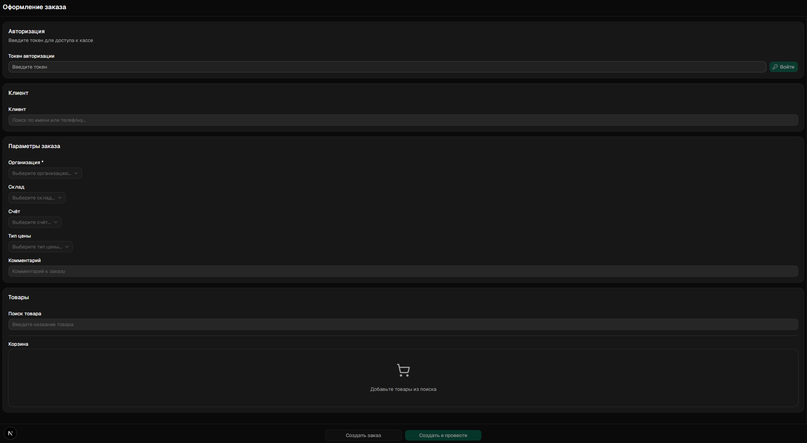

# TABLECRM Mobile Order Form

Mobile-first single-screen order form integrated with TABLECRM API. Designed for sales teams to create orders and sales directly from mobile devices.

## Screenshots



## Highlights

- Token-based authentication with TABLECRM API validation
- Customer search by name or phone with one-click selection
- Order parameter configuration: organization, warehouse, paybox, price type, comments
- Product search with add-to-cart functionality
- Editable cart with quantity/price adjustment and real-time total calculation
- Order creation with optional posting
- Optimized rendering with React.memo and useCallback
- Zod-validated API responses

## Stack

- Next.js 16 (App Router)
- React 19
- TypeScript
- Bun
- shadcn/ui + Tailwind CSS
- @tanstack/react-query
- React Hook Form + Zod
- sonner
- Vercel

## Flow

1. Enter your TABLECRM API token to authenticate.
2. Search and select a customer by name or phone.
3. Set order parameters: organization, warehouse, paybox, price type, and comments.
4. Search for products and add them to the cart.
5. Adjust item quantities, prices, and review the total in the cart.
6. Create the order (with or without posting).

## Structure

```text
app/            routes and layouts
components/     UI and feature components (order form, auth, cart, etc.)
hooks/          React Query API hooks
lib/            API client and Zod schemas
docs/images/    README assets
```

## Run

```bash
bun install
bun run dev
```

Open `http://localhost:3000`.

Production:

```bash
bun run build
```
